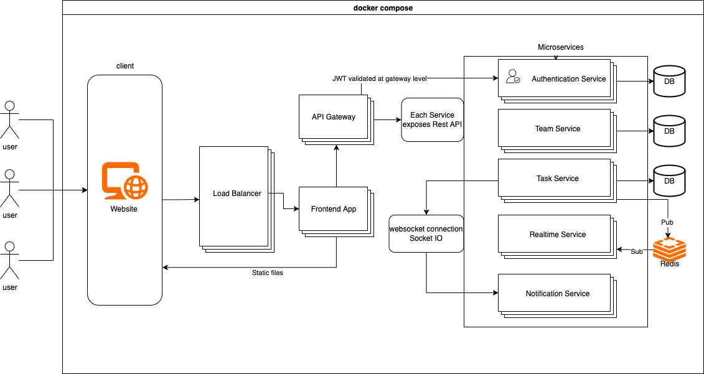

# TodolistProject
DHBW Heidenheim INF2023 Semester 4 Verteilte System Lab Project

Team member: Ziyi Hong, Danylo Tulainov

---
## 1. Architecture:


---
## 2. Branching strategy: 
[Check here](docs/branching.md)

## 3. Docs:
[Backend](docs/README.md)

---
## 4. Quick Start:

### Prerequisites
- Docker and Docker Compose
- Go 1.21+ (for local development)

### Starting Services
```bash
# Start all services
docker compose up -d

# View logs
docker compose logs -f

# Stop all services
docker compose down
```

### Service URLs
- **Auth Service**: http://localhost:8084
- **Team Service**: http://localhost:8082  
- **Task Service**: http://localhost:8081
- **Auth Database**: http://localhost:8085 (phpMyAdmin)
- **Team Database**: http://localhost:8086 (phpMyAdmin)
- **Task Database**: http://localhost:8087 (phpMyAdmin)
