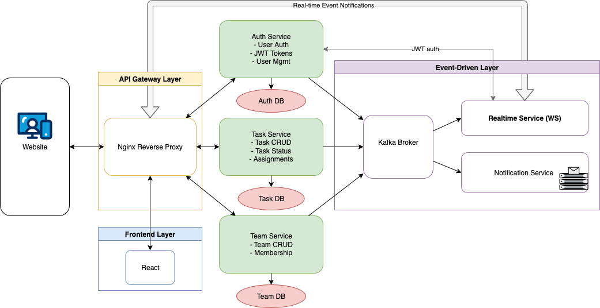

# Todo List Project

**DHBW Heidenheim INF2023 Semester 4 - Distributed Systems Lab Project**

**Team Members**: Ziyi Hong, Danylo Tulainov

---

## Overview

A distributed, real-time collaborative Todo application built with microservices architecture. Features include team-based task management, real-time updates via WebSocket, and event-driven communication using Apache Kafka.

## Architecture



## Branching strategy: 
[Check here](docs/branching.md)

## Docs:
Find all the documentation in docs/

- [Setup Guide](docs/setup.md) - Detailed setup instructions
- [Overview for the whole documentation](docs/overview.md)
- [Backend](docs/backend/backend_overview.md) - Backend related documentation
- [frontend](docs/frontend/frontend_overview.md) - Frontend related documentation

---
## Quick Start:

### Starting Services
```bash
# Start all services
docker compose up -d

# View logs
docker compose logs -f

# Stop all services
docker compose down
```