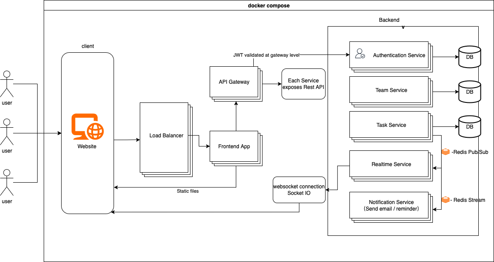

# Architectur and Implementation #

## 1. Architektur

### Diagram


### 1.1 General Overview
**Solution**  
This project is a distributed Todo application system designed with a microservices architecture.  
The initial design followed a pure microservices approach, but later—due to requirements from another course (Verteilte Systeme)—we extended the system with Apache Kafka.   
This addition introduced an event-driven component, where Apache Kafka serves as the message middleware to enable asynchronous communication between the backend core business services (task,team,auth services), realtime service and notification service.   
Kafka was implemented after the development of core business services. So it doesn't support the communication between the three core business services. The business services (Auth, Task, Team) communicate via REST APIs. Task, Team and Auth services publish events to Kafka. Realtime and Notification services consume these events for real-time updates and email notifications.


**Core Architecture Features:**  
Microservices Architecture: Decomposed monolithic application into independent services (Auth, Team, Task, Realtime, Notification)  
Event-Driven: Using Kafka for loose coupling between (some) services  
Real-time Communication: Providing real-time updates through WebSocket 
Containerized Deployment: Using Docker and Docker Compose for service orchestration  
Load Balancing: Implementing API gateway and load balancing through Nginx

### 1.2 Key Architectural Decisions
- Microservices: Independent services (Auth, Team, Task, Realtime, Notification) for scalability and maintainability.
- Kafka: High-throughput message broker for event streaming and persistence.
- WebSocket: Real-time bidirectional communication for collaborative features.
- Seperate Database: Data isolation and independent scaling.

#### Original Architecture


The original architecture was already microservices-based but used Redis for caching and direct service communication.

### 1.3 System Components
- Frontend: React 18 + TypeScript SPA with WebSocket client
- API Gateway: Nginx reverse proxy with load balancing
- Services:
    - Auth Service: JWT authentication, user management
    - Team Service: Team CRUD, member management
    - Task Service: Task CRUD, event publishing
    - Realtime Service: WebSocket hub, Kafka consumer
    - Notification Service: Email notifications
    - Data: MySQL databases (one per service)
    - Message Broker: Apache Kafka

## 2. Data Flow Architecture

### Authentication Flow
```
User → Frontend → Nginx → Auth Service → Auth DB
                ↓
            JWT Token → Frontend Storage
```

### Task Management Flow
```
User → Frontend → Nginx → Task Service → Task DB
                ↓              ↓
            JWT Validation  Team Service (permission check)
                ↓              ↓
            Auth Service    Team DB
```

### Real-time Updates Flow
```
Task Service → Kafka → Realtime Service → WebSocket → Frontend
     ↓              ↓
Notification Service → SMTP → Email
```

### Event-Driven Architecture
```
Service Actions → Kafka Events → Multiple Consumers
                      ↓
              ┌─────────────────┐
              │ Realtime Service│ → WebSocket Updates
              └─────────────────┘
                      ↓
              ┌─────────────────┐
              │Notification Svc │ → Email Notifications
              └─────────────────┘
```

## 3. Technology Stack

### Backend Services
- **Language:** Go 1.21+
- **Framework:** Gin (HTTP framework)
- **Database:** MySQL 8.0
- **Message Queue:** Apache Kafka
- **Authentication:** JWT (JSON Web Tokens)
- **Migration:** DBMate

### Frontend
- **Framework:** React 18 with TypeScript
- **Build Tool:** Vite
- **Routing:** React Router
- **State Management:** React Context + Local Storage
- **Real-time:** WebSocket API
- **HTTP Client:** Fetch API

### Infrastructure
- **Containerization:** Docker & Docker Compose
- **Reverse Proxy:** Nginx
- **Development:** Mailpit (SMTP testing)
- **Database Admin:** phpMyAdmin (optional)

### Key Implementation Details

- Backend by Ziyi Hong: [backend_overview](backend/backend_overview.md)
- Frontend by Danylo Tulainov: [frontend_overview](frontend/frontend_overview.md)

\newpage

